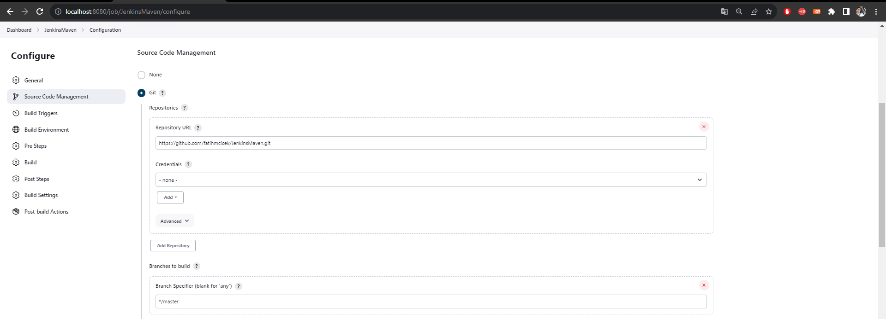
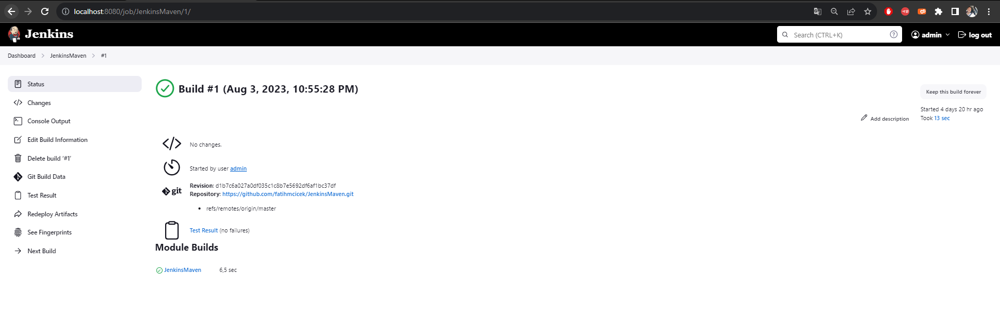
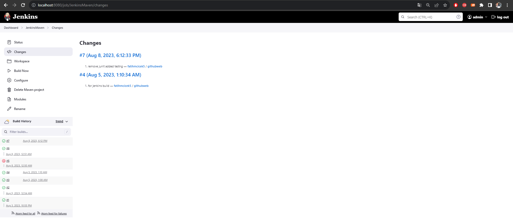

<p align="center">
    <a href="https://jenkins.io">
        
    </a>
</p>


# Simple Java Maven Project

This repository is for the [Build](https://www.jenkins.io/doc/) a simple java project with Maven tutorial in the 
[Jenkins User Documentation.](https://www.jenkins.io/doc/tutorials/)
****
## Description:

This repository is prepared for Jenkins Maven Git integration. It is a simple project with installations completed on a [local machine.](http://localhost:8080/) TestNg can be used to obtain results, and mail integrations have been set up for these results. Of course, since this information is relevant within the job, you should take a look at [Medium account](https://medium.com/@fatihmcicek/list/cicd-jenkins-e8ea327bf791).


## [](https://medium.com/@fatihmcicek)


```
git clone https://github.com/hasibrahat10/MavenTest.git
mvn clean install 
mvn test
```

## Jenkins Results:
****
### Result 1:

### Result 2:

### Result 3:

